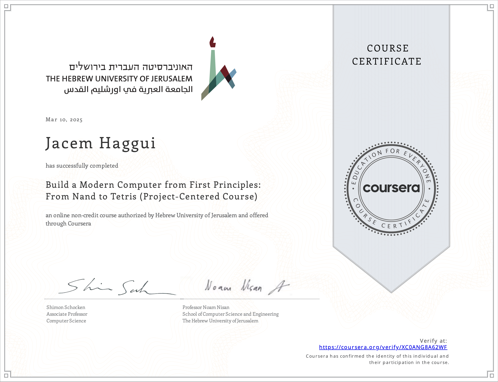

# Building a Computer from Scratch  

This repository contains my work and progress for the [Nand2Tetris](https://www.nand2tetris.org) course, a project-based journey from building basic NAND logic gates to creating a functional computer.

## About the Course  
Nand2Tetris is a hands-on course that takes you through the fundamental concepts of computer science and hardware engineering. By the end, participants will have designed and implemented a computer from scratch, including its hardware architecture, machine language, assembler, virtual machine, and high-level programming language.  

## Progress Overview  

### 1. Logic Gates  
The foundation of computing starts with basic logic gates. I implemented:  
- **Elementary Gates:** `AND`, `OR`, `MUX`, `NOT`, `XOR`  
- **Bitwise Variants:** `AND16`, `OR16`, `MUX16`, etc. (for a 16-bit architecture)  

### 2. Arithmetic Logic Unit (ALU)  
Building on the logic gates, I designed the core arithmetic and logic processing unit:  
- **Half-Adder & Full-Adder**  
- **16-bit Adder (`Add16`)**  
- **16-bit Incrementer (`Inc16`)**  
- **Arithmetic Logic Unit (`ALU`)** – Implements addition, bitwise operations, and conditional negation  

### 3. Memory Architecture  
Using a **D Flip-Flop (DFF)** as the fundamental memory element, I built progressively larger storage units:  
- **Bit Storage (`Bit`)**  
- **Register (`Register`)**  
- **Hierarchical RAM Design:**  
  - `RAM8` → `RAM64` → `RAM512` → `RAM4K` → `RAM16K`  
- **Program Counter (`PC`)**  

### 4. Machine & Assembly Language  
With the hardware foundation in place, I am now working on understanding and implementing:  
- **Machine Language** – Writing low-level instructions for the simulated CPU  
- **Assembly Language** – Getting familiar with instruction translation  
- **Assembler (Upcoming)** – A tool to convert assembly code into machine code  

## Next Steps  
- Implement the **CPU** and integrate it with memory to form a complete computer  
- Develop an **Assembler** to automate the translation from assembly to machine code  
- Write programs to test the full system  

## Acknowledgments  
This work represents my learning journey and solutions. I encourage anyone interested in understanding computer science at its core to explore [Nand2Tetris](https://www.nand2tetris.org).  

Feel free to explore the repository and reach out if you have any questions or suggestions.  
